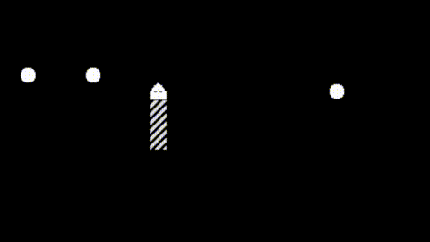

# 🐍 Snake Game

This is an implementation of the classic snake game in Godot using C# with 1-bit graphics.

## The two modes

The game can be played with the WASD keys or let the game ai play by itself.

The ai uses Godot's built-in AStarGird class to find the shortest path between the current position of the snake's head and the food.
